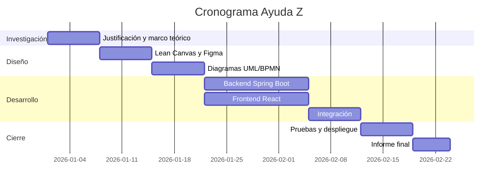

# Cronograma de Actividades

> Completar fechas reales antes de la entrega. Formato sugerido tipo Gantt en tabla.

| Fase | Actividad | Semana inicio | Semana fin | Responsable(s) |
|---|---|---|---|---|
| 1 | Levantamiento de información y realidad problemática | | | |
| 2 | Justificación y marco teórico | | | |
| 3 | Definición de objetivos | | | |
| 4 | Modelado Lean Canvas | | | |
| 5 | Prototipado en Figma | | | |
| 6 | Diagramas UML / BPMN | | | |
| 7 | Diseño de base de datos (PostgreSQL) | | | |
| 8 | Desarrollo del backend (Spring Boot) | | | |
| 9 | Desarrollo del frontend (React) | | | |
| 10 | Integración backend-frontend | | | |
| 11 | Pruebas y ajustes | | | |
| 12 | Despliegue (Render / Netlify) | | | |
| 13 | Informe final y presentación | | | |

## Diagrama de Gantt

Puede generarse a partir de esta tabla usando herramientas como GanttProject, Excel, o directamente en Mermaid dentro de este mismo archivo, por ejemplo:

